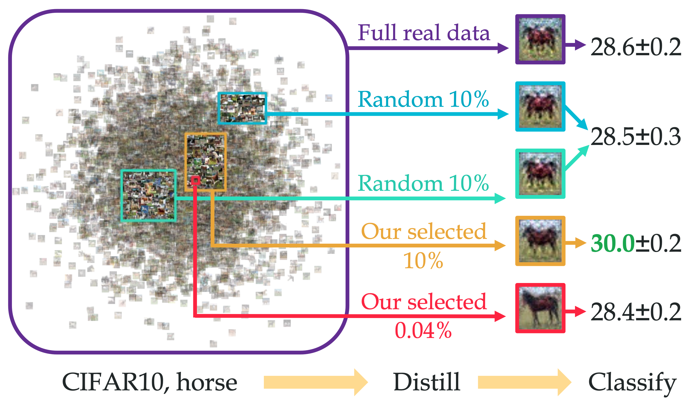

# Distill Gold From Massive Rres

This is official implementation (preview version) of [**Distill Gold From Massive Ores: Efficient Dataset Distillation via Critical Samples Selection**](https://arxiv.org/abs/2305.18381). This is the very first work that systematically study the data redundancy in the dataset distillation. We propose multiple effective criteria for pruning, and we hope our observation, analysis and empirical results could provide deeper insight into the internal mechanism of dataset distillation and neural network training.

<p align="center"></p>

## Usage

Our method is neatly packaged as a plug-and-play module in just a **single line of code** in most algorithms.
Take DC/DSA/DM as an example, to use our data pruning plugin:

1. Clone our repository.
```
git clone https://github.com/silicx/GoldFromOres.git
cd GoldFromOres
```

2. Download/Clone the code of the distillation algorithms in the folder and setup the environment. E.g.
```
git clone https://github.com/VICO-UoE/DatasetCondensation.git
```

3. Add this key line to apply data pruning:
```
images_all, labels_all, indices_class = drop_samples(
    images_all, labels_all, indices_class, 
    args.dataset, args.drop_criterion, drop_ratio=args.drop_ratio)
```
with these small modification:
```
...
import drop_samples from drop_utils
...
parser.add_argument('--drop_criterion', type=str)
parser.add_argument('--drop_ratio', type=float)
...
```
Here, `drop_ratio` is a scalar in [0.0, 1.0].
`drop_criterion` can be chosen among:

| Drop_criterion | Description |
| :-  | :- |
| Random             | Randomly drop samples |
| LossConverge_large | Drop samples with large loss value after convergence |
| LossConverge_small | Drop samples with small loss value after convergence |
| LossInit_large     | Drop samples with large loss value in the initial epochs |
| LossInit_small     | Drop samples with small loss value in the initial epochs |
| MonteCarlo_large   | Drop samples with large utility, estimated by Monte-Carlo alg. |
| MonteCarlo_small   | Drop samples with small utility, estimated by Monte-Carlo alg. |

And our empirical analysis show that dropping with criterion `LossConverge_large`, `LossInit_large`, `MonteCarlo_small` yields better performance.


4. Run the command with specified pruning criterion and ratio. e.g.
```
python -m DatasetCondensation.main --dataset CIFAR10 --model ConvNet --ipc 1 --drop_criterion LossInit_large --drop_ratio 0.99
python -m DatasetCondensation.main_DM --dataset CIFAR10 --model ConvNet --ipc 1 --dsa_strategy color_crop_cutout_flip_scale_rotate --init real --lr_img 1 --drop_criterion LossInit_large --drop_ratio 0.99
```


**Note that** the random pruning method on some multi-stage distillation algorithm (e.g. MTT-based) needs some adaptation to avoid using different samples in two stages.


## Reference

If you find our work useful and inspiring, do not hesitate to cite:
```
@article{xu2023distill,
  title={Distill Gold from Massive Ores: Efficient Dataset Distillation via Critical Samples Selection},
  author={Xu, Yue and Li, Yong-Lu and Cui, Kaitong and Wang, Ziyu and Lu, Cewu and Tai, Yu-Wing and Tang, Chi-Keung},
  journal={arXiv preprint arXiv:2305.18381},
  year={2023}
}
```

## To-do List

This is currently the preview version of our work, taking DC/DSA/DM as an example. We will upload our code on other algorithms soon.

- [x] DC/DSA/DM
- [ ] MT
- [ ] CAFE
- [ ] LinBa
- [ ] HaBa
- [ ] FRePo
- [ ] IDC
- [ ] RFAD
- [ ] IDM

## Acknowledgement
As our method is applied across various dataset distillation algorithms, we sincerely thank all the colleagues for their dedicated contributions to the open-source community, including but not limited to:

- DC/DSA/DM: Dataset Condensation with Gradient Matching, Dataset Condensation with Differentiable Siamese Augmentation, Dataset Condensation with Distribution Matching, [Github](https://github.com/VICO-UoE/DatasetCondensation/)
- MTT: Dataset Distillation by Matching Training Trajectories, [Github](https://github.com/GeorgeCazenavette/mtt-distillation)
- CAFE: Learning to Condense Dataset by Aligning Features, [Github](https://github.com/kaiwang960112/cafe)
- FRePo: Dataset Distillation using Neural Feature Regression, [Github](https://github.com/yongchao97/FRePo)
- RFAD: Efficient Dataset Distillation using Random Feature Approximation, [Github](https://github.com/yolky/RFAD)
- IDC: Dataset Condensation via Efficient Synthetic-Data Parameterization, [Github](https://github.com/snu-mllab/efficient-dataset-condensation)
- IDM: Improved Distribution Matching for Dataset Condensation, [Github](https://github.com/uitrbn/IDM)
- LinBa: Remember the Past: Distilling Datasets into Addressable Memories for Neural Networks, [Github](https://github.com/princetonvisualai/RememberThePast-DatasetDistillation)
- HaBa: Dataset Distillation via Factorization, [Github](https://github.com/Huage001/DatasetFactorization)

... as well as the [Awesome](https://github.com/Guang000/Awesome-Dataset-Distillation) project.